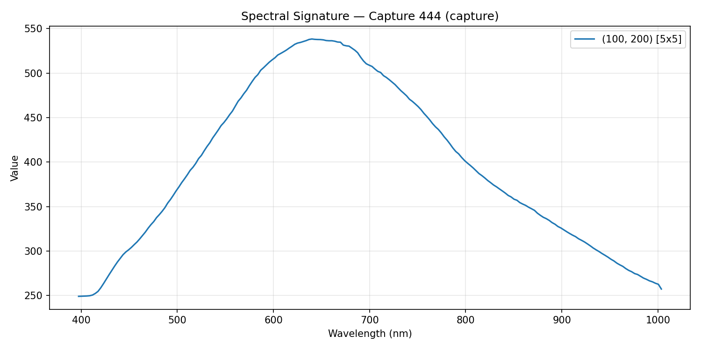
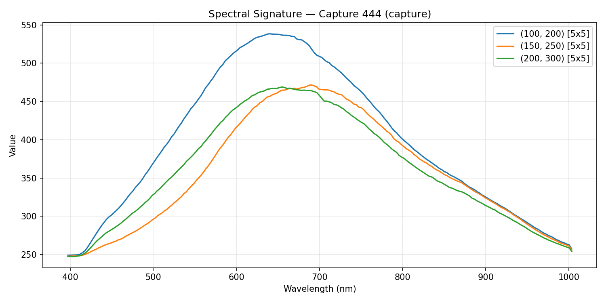
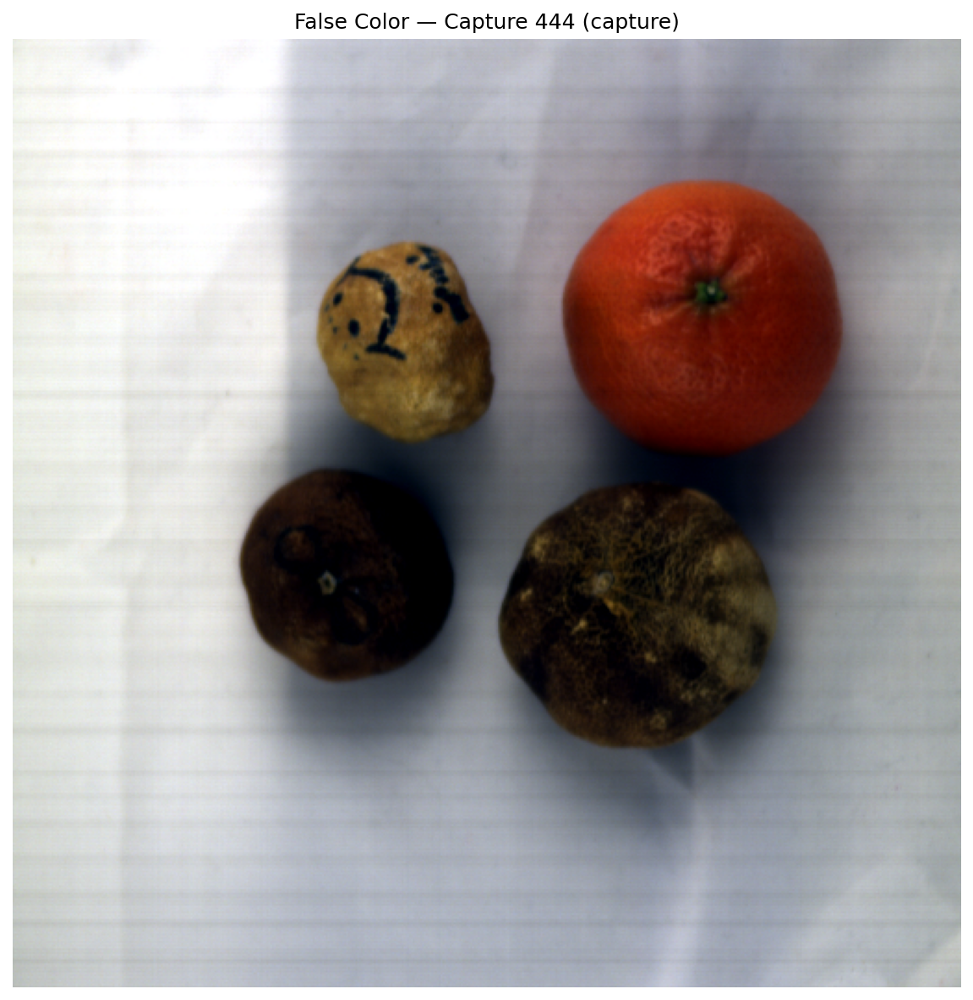

# HU-JYU Hyperspectral Dataset

Hyperspectral image captures recorded with a Specim IQ portable camera, along with Python tools for data conversion, visualization, and analysis.

## Sensor Specifications

| Parameter | Value |
|---|---|
| Sensor | Specim IQ |
| Spectral range | 397 – 1004 nm |
| Spectral bands | 204 |
| Spectral resolution | ~2.88 nm |
| Spatial resolution | 512 x 512 pixels |
| Data format | ENVI (BIL interleave) |

## Dataset Structure

Each numbered folder under `data/` (e.g. `data/444/`) is a single capture session:

```
data/444/
├── 444.png                          # Preview thumbnail
├── manifest.xml                     # File index
├── capture/
│   ├── 444.hdr / 444.raw           # Raw datacube (uint16)
│   ├── WHITEREF_444.hdr / .raw     # White reference
│   ├── DARKREF_444.hdr / .raw      # Dark reference
│   └── WHITEDARKREF_444.hdr / .raw # White-dark reference
├── results/
│   ├── REFLECTANCE_444.hdr / .dat  # Calibrated reflectance (float32)
│   ├── REFLECTANCE_444.png         # Reflectance preview
│   ├── RGBSCENE_444.png            # RGB scene image
│   ├── RGBVIEWFINDER_444.png       # Viewfinder image
│   └── RGBBACKGROUND_444.png       # Background image
└── metadata/
    └── 444.xml                      # Device info, timestamp, GPS, settings
```

- **capture/** contains the raw datacube and radiometric calibration references.
- **results/** contains the reflectance datacube (already calibrated using the white/dark references) and RGB previews.

Script outputs are organized under `output/`:

```
output/
├── mat/          # Converted .mat files
├── spectra/      # Spectral signature plots
├── false_color/  # False-color visualizations
├── stats/        # Band statistics CSV exports
└── examples/     # Example outputs (tracked in git)
```

## Data Download

The hyperspectral data files are not included in this repository due to their size. Download link will be shared in the future. Once downloaded, place the capture folders (e.g. `444/`, `445/`, ...) inside the `data/` directory.

## Setup

Create and activate the conda environment
```bash
conda env create -f environment.yml
conda activate hsi
```

Or install manually:

```bash
conda create -n hsi python=3.11 -y
conda activate hsi
pip install numpy scipy matplotlib spectral
```

## Tools

### Convert ENVI to .mat

Convert a raw or reflectance ENVI datacube to a MATLAB `.mat` file. The output contains keys `cube` (the 3D array) and `wavelengths`.

```bash
# Convert raw capture
python envi_to_mat.py 444 -o output/mat/444.mat

# Convert reflectance data
python envi_to_mat.py 444 --source results -o output/mat/444_reflectance.mat

# Convert a calibration file
python envi_to_mat.py 444 --prefix WHITEREF -o output/mat/444_whiteref.mat
```

### Spectral Signature

Plot the spectral signature at a given pixel location. By default, the spectrum is averaged over a 5x5 neighborhood to reduce noise.

```bash
# Plot spectrum at row=100, col=200
python spectral_signature.py 444 100 200 --save output/spectra/signature.png

# Compare multiple pixels
python spectral_signature.py 444 100 200 --also 150,250 200,300 --save output/spectra/signature_multi.png

# Change averaging window size (default: 5)
python spectral_signature.py 444 100 200 --window 11

# Single pixel, no averaging
python spectral_signature.py 444 100 200 --window 1

# Use reflectance data
python spectral_signature.py 444 100 200 --source results --save output/spectra/signature_refl.png
```

**Example — single pixel:**



**Example — multiple pixels:**



### False-Color Visualization

Generate a false-color RGB image from the datacube. Default bands are read from the ENVI header (bands 70, 53, 19 corresponding to ~542, 492, 452 nm).

```bash
# Default false-color
python false_color.py 444 --save output/false_color/444.png

# Custom bands (R, G, B as 0-indexed band numbers)
python false_color.py 444 --bands 100 70 30 --save output/false_color/444_custom.png

# From reflectance data
python false_color.py 444 --source results --save output/false_color/444_refl.png
```

**Example:**



### Band Statistics

Print per-band statistics (min, max, mean, standard deviation) for quick quality assessment.

```bash
# Print stats table
python band_stats.py 444

# Export to CSV
python band_stats.py 444 --csv output/stats/444_stats.csv
```

### Common Options

All scripts share these options:

| Option | Description |
|---|---|
| `--source capture` | Use raw datacube from `capture/` folder (default) |
| `--source results` | Use calibrated reflectance from `results/` folder |
| `--prefix WHITEREF` | Use a calibration reference file (WHITEREF, DARKREF, WHITEDARKREF) |
| `--mat path.mat` | Use a pre-converted .mat file instead of reading ENVI directly |

## Using in Python

The scripts can also be imported as modules:

```python
from envi_to_mat import read_envi_cube, resolve_paths
from spectral_signature import load_cube, extract_spectrum
from false_color import false_color

# Read a datacube
cube, wavelengths, meta = read_envi_cube("data/444/capture/444.hdr", "data/444/capture/444.raw")

# Get averaged spectrum at a pixel
spectrum = extract_spectrum(cube, row=256, col=256, window=5)

# Generate false-color RGB array
rgb = false_color(cube, bands=[69, 52, 18])
```

## License

Please cite this dataset appropriately if you use it in your research.